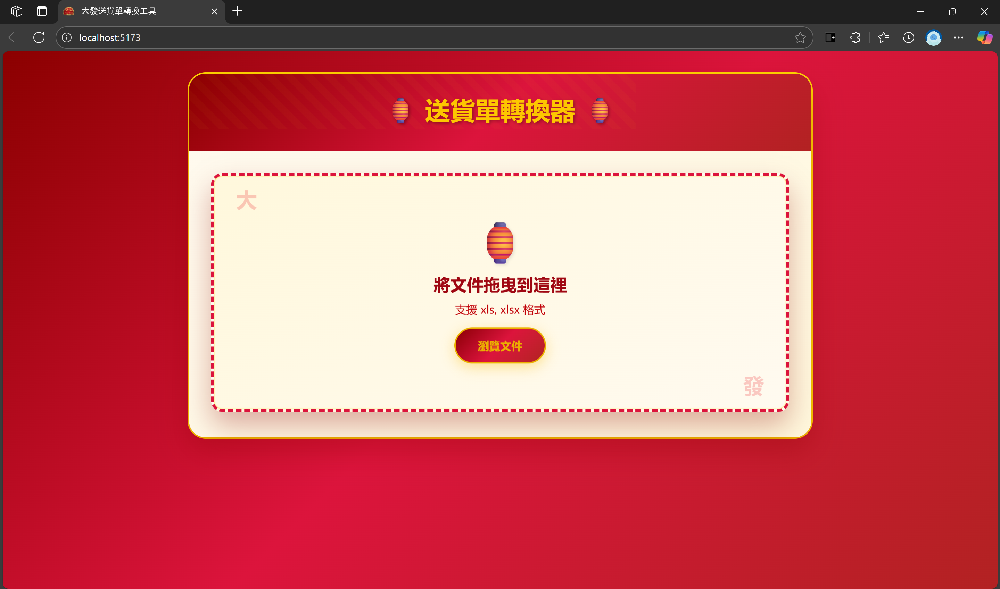
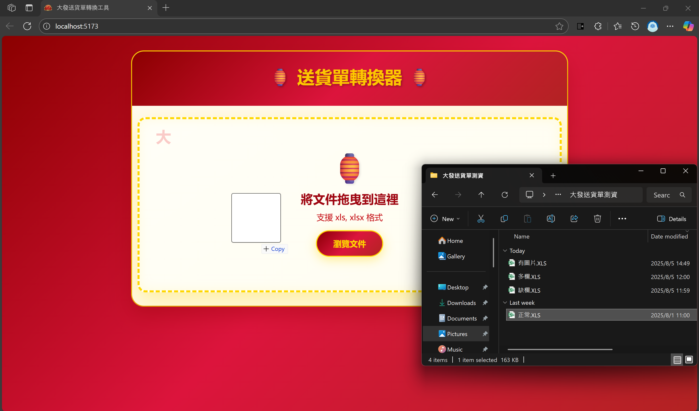
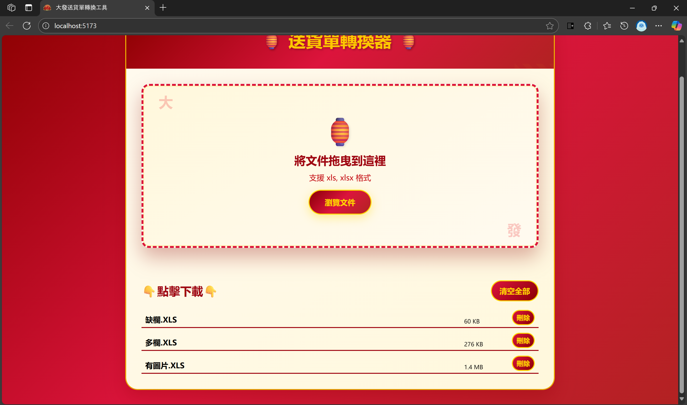
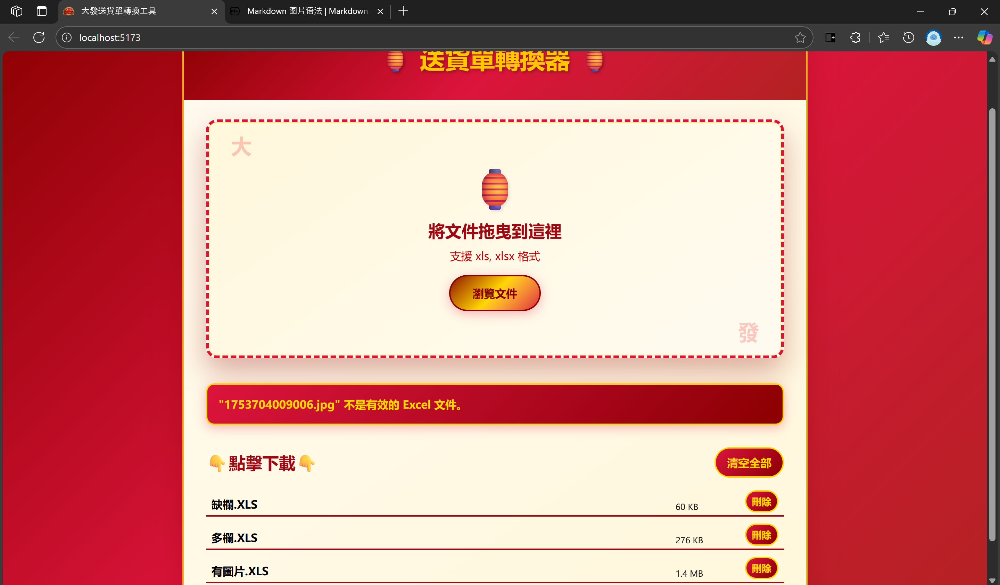

# 大發送貨單轉換網頁工具

## 如何使用
### 介面功能

1. 將檔案拖曳至拖曳區，或點擊拖曳區瀏覽檔案。可同時上傳多個文件



2. 檔案轉換完成後，將顯示於下方下載區


3. 點擊檔名，即可下載檔案。

4. 點擊刪除，可移除檔案。

5. 若上傳檔案格式錯誤，或後端系統錯誤，介面顯示錯誤訊息。


### 檔案轉換格式
|下載檔案欄位|下載檔案欄位名稱|上傳檔案欄位/填充字串|
|---------|-----------------|---|
|A|訂單號碼|E |
|B|寄件件數|'1'|
|C|尺寸|'1'|
|D|重量|'1'|
|E|品名|V|
|F|收件公司|I|
|G|收件者姓名|AJ|
|H|收件地址|J|
|I|收件電話|AJ|
|J|寄件公司|"大發公司"|
|K|寄件者姓名|"大發公司"|
|L|代收貸款|D|
|M|指定配送日期|F|
|N|備註1|R|
|O|備註2|AN|

## 即將推出
- 一鍵下載全部
- 名字、手機號碼拆分

## (For developer) Steps to run at local
1. clone this repo

### Backend
2. Start venv and install dependencies
```bash
# @backend
python -m venv .venv
.venv/Scripts/activate # activate venv
pip install -r requirements.txt
```

3. Start Flask
```bash
# @backend
flask run dev
```

### Frontend

4. Install dependencies
```bash
# @frontend
npm install
```

5. Edit .env.example
copy `.env.example` as `.env.local` and type in the API address of the backend.


6. Start frontend
```bash
# @fronend
npm run dev
```

